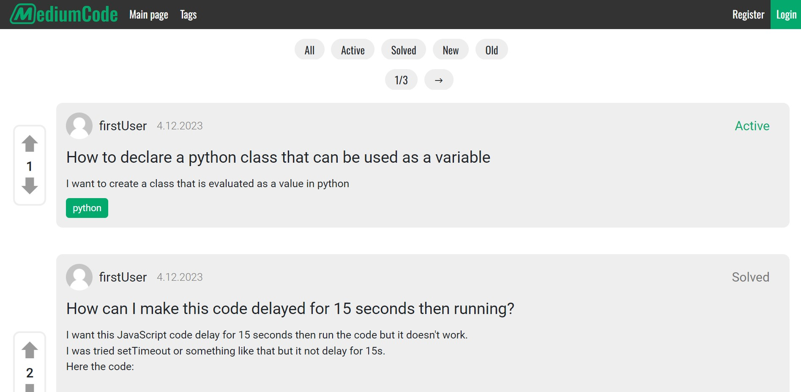
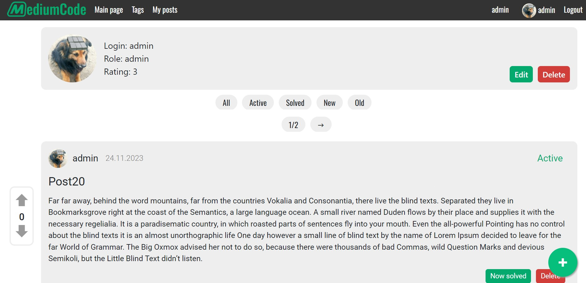
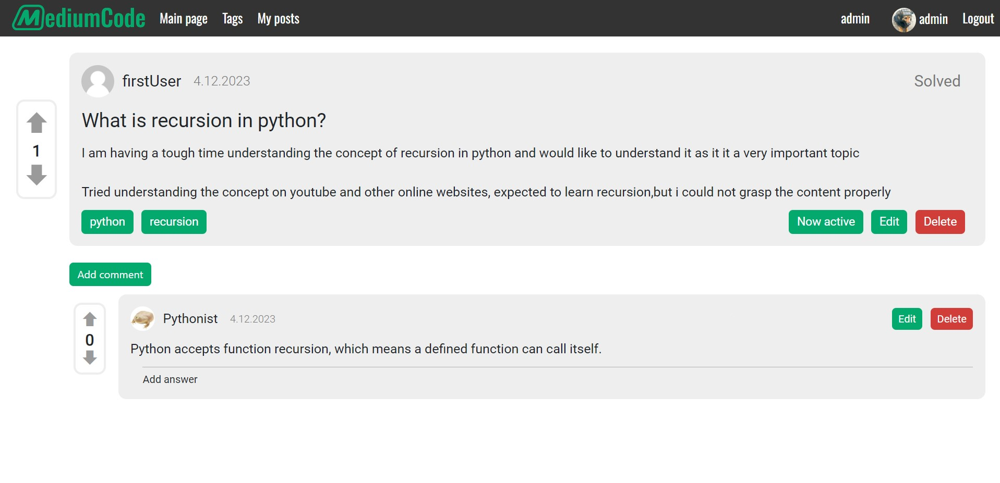

# USOF Documentation

Made By Maksym Cherednychenko

## USOF Backend
It makes registration, posting, commenting, liking and adding categories to posts possible.

### Requirements
- NodeJS
- NPM
- MySQL Database
  
### How to run
1. Go to API dir
2. Configure .env file
3. Run db.sql on your MySQL Server
4. Run "npm i" to install node modules
5. Run "npm start" or "node index" in the API directory
6. API will run on port 5000 (can be configure in .env)

## USOF Frontend
It is frontend part of this project.

### Requirements
- NodeJS
- NPM
  
### How to run
1. Go to client dir
2. Configure .env file (if you change API adress)
3. Run "npm i" to install node modules
4. Run "npm start" or "node index" in the client directory
5. Open your browser and go to http://localhost:3000 to view the app
